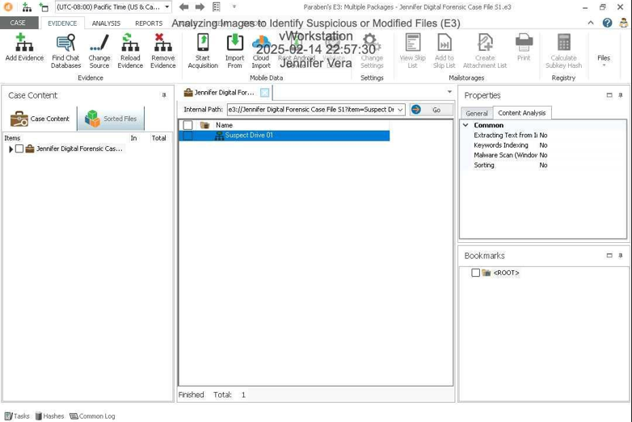
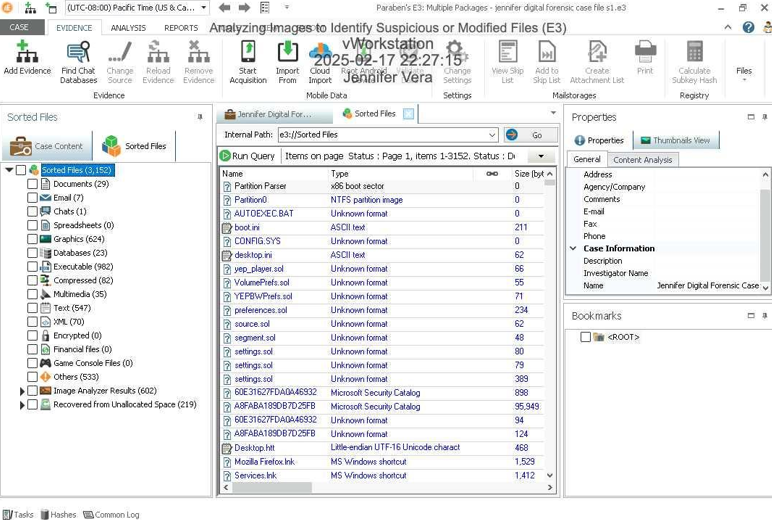
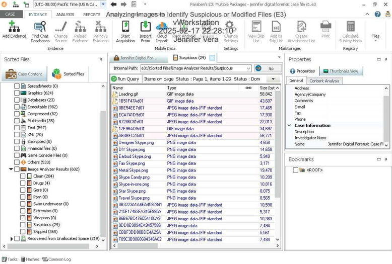
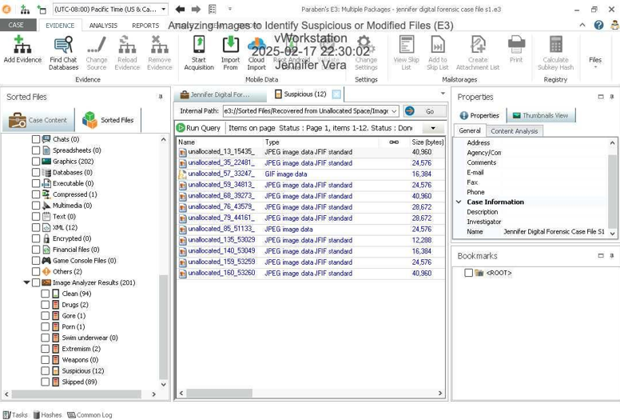
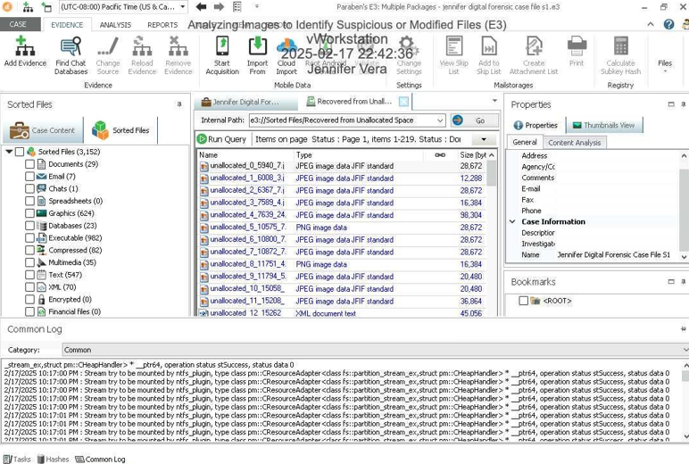
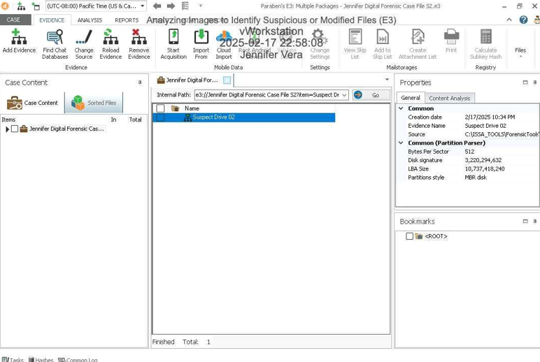
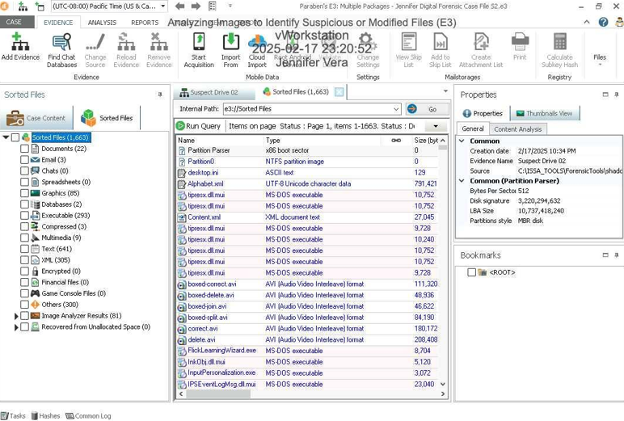
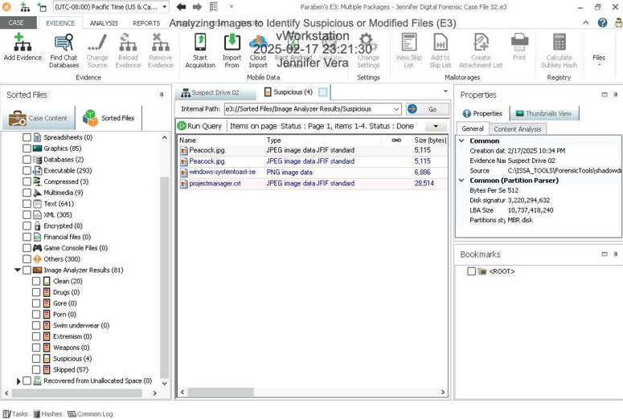
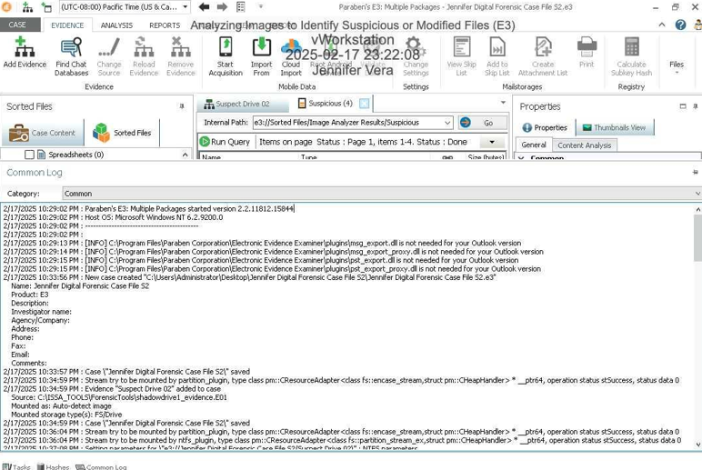
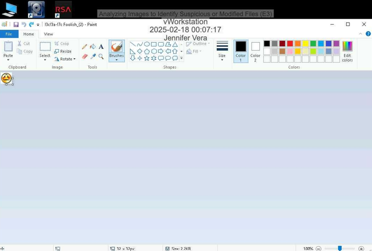

# Lab 05: Analyzing Images to Identify Suspicious or Modified Files (E3)

This lab was completed as part of my Digital Forensics coursework at De Anza College, where I am pursuing a Certificate of Achievement in Cybersecurity with a focus on digital forensics and investigation.

## 🔍 Overview

In this lab, I used **Magnet Forensics E3** to analyze a suspect drive image. The objective was to identify suspicious or modified image files that could potentially be linked to criminal activity or inappropriate content.

## 🧪 Objectives

- Create a new case in the E3 platform
- Load and analyze the “Suspect Drive 01” evidence file
- Use **Image Analyzer** to sort, categorize, and flag image files
- Differentiate between clean, suspicious, and recovered files
- Document and capture all findings

## 📊 Results

| Category                               | Number of Files |
|----------------------------------------|------------------|
| Total Sorted Files                     | 3152             |
| Clean Files                            | 204              |
| Suspicious Files                       | 29               |
| Clean (Unallocated Space)              | 94               |
| Suspicious (Unallocated Space)         | 12               |

## 🛠️ Tools Used

- **Magnet E3 Platform** – Image sorting & metadata extraction
- **Windows 11** – Virtual forensic environment
- **Screenshots** – Included in `lab05_screenshots/` folder

## 👩‍💻 Student Information

- **Name:** Jennifer Vera  
- **Program:** Cybersecurity A.S. – Digital Forensics Track  
- **College:** De Anza College  
- **Certificate:** Cybersecurity – Certificate of Achievement  
- **Lab Instructor:** *Felix Amoruwa*  
  

## 🗂 Screenshots & Supporting Evidence

All screenshots taken during the lab (including image analyzer results, suspicious files list, and case setup) are located in the folder:## Part 1: Identifying Modified Image Files

### 01 - Case Creation in E3

### 02 - Sorted Files

### 03 - Suspicious Files Identified

### 04 - Unallocated Space Files

### 05 - Timestamp from Common Log (Part 1)

### 06 - Suspect Drive View (Part 2)

### 07 - Sorted Files (Different View)

### 08 - Suspicious Files (Expanded View)

### 09 - Timestamp from Common Log (Part 2)

---

## Part 2: Tools and Commands

### 10 - Search for Keyword “Foolish”

---

## Part 3: Challenge Exercise

### 11 - MD5 Hash Verification

